# Adventure Time RPG

Adventure Time RPG is a python terminal text based Role Playing Game. It is based somewhat on retro games such as 'Zork' (1977) and tabletop games like Dungeons and Dragons. In this game the user or 'player' enters a name, chooses a player class; Archer, Warrior, or Wizard, and then embarks on a short adventure through the dungeon they find themselves in. There are monsters to battle, traps to try and avoid, and rooms to make your way through, until you conquer the dungeon. The live version is deployed on heroku.

The live link can be found here - https://adventure-time-rpg.herokuapp.com/

Initial map drawn of dungeon and commands

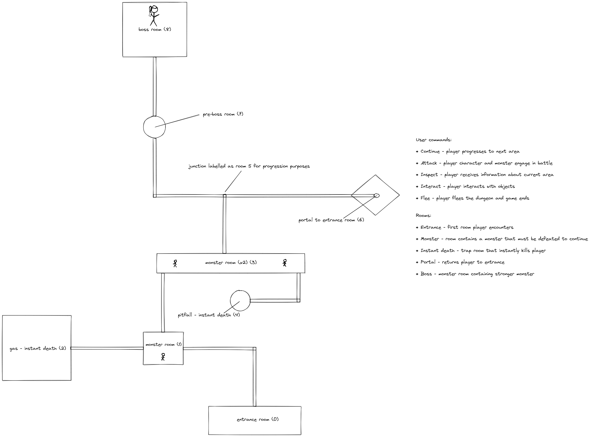 

AmIResponsive snip

 

## How to Play

The user is initially asked to input a name and choose a class. The 3 three classes are Archer, Warrior, and Wizard. These two choices then build a player 'character'. The players choice of class dictates their 'health point' and 'attack' attributes, which are randomly generated within a range for the specific class. These are relevant when battling monsters.

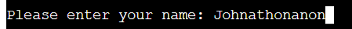

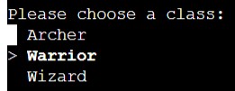

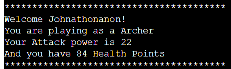
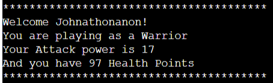
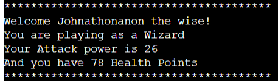

The player navigates the dungeon via a 'menu'. This menu is navigated using the arrow keys and enter key. The player has 5 choices to choose from: 
- Continue - this progresses the game to the next room if available, a short 'progress text' is printed to the terminal.
- Inspect - a brief description of the current area is printed to the terminal.
- Attack - a battle in initiated with a monster if present.
- Interact - allows the player to interact with objects if applicable.
- Flee - player flees the dungeon and ends game.

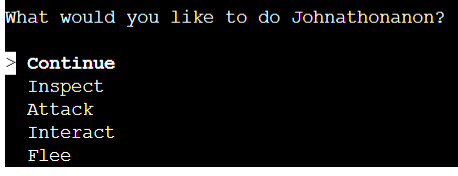

## Features

### Existing Features

- **Player Creation**

  - User can create a 'custom' character. This includes entering a name, which defaults to 'Adventurer' if left empty, and choosing a class, with randomised stats.

  

  

- **Menu**

  - This is the main navigation tool of the game. Player has is given 5 choices:
    - Continue - this progresses the game to the next room if available, player is presented with direction choices depending on current room. Current room is then updated and a short 'progress text' is printed to the terminal. If monster presence > 0 or current room is 6 player cannot progress. If chosen direction is death room, player 'dies'.

    

    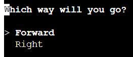

    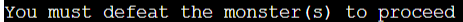

    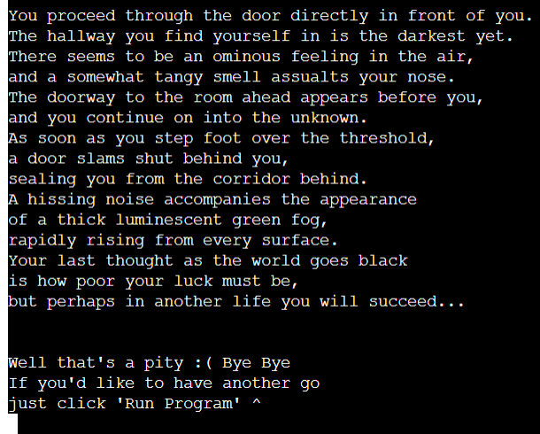

    - Inspect - a brief description of the current area is printed to the terminal. Sometimes changes depending on in monster is 'dead' or 'alive'.

    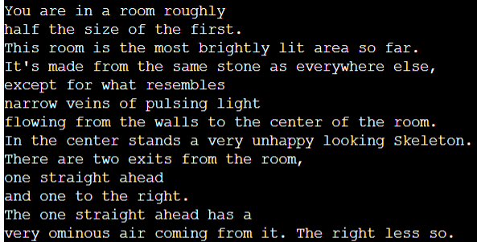

    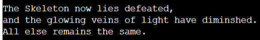

    - Attack - a battle in initiated with a monster if present. During the battle, the monster and player 'attack' each other and both their health points are reduced. If monster is defeated monster presence updates and player may continue to next room. If player is defeated game ends.

    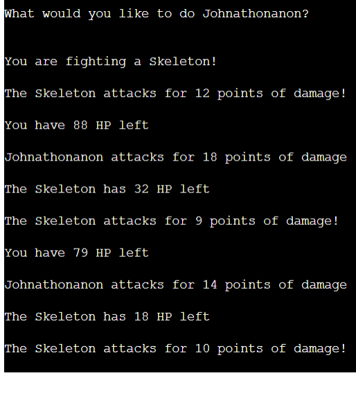

    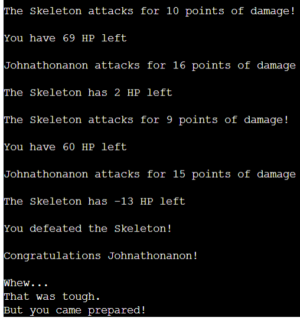

    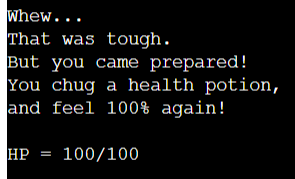

    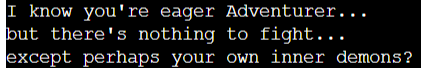

    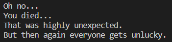

    - Interact - allows the player to interact with objects if applicable or prints a message if not. Main interactable object is portal in room 6 which 'teleports' player back to room one. This is done by updating current room value.

    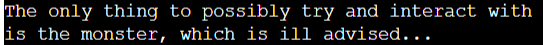

    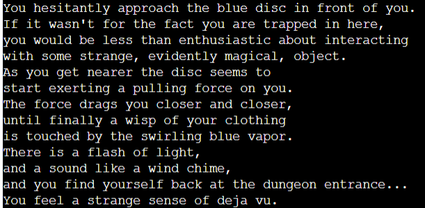

    - Flee - player flees the dungeon and ends game, a goodbye message is printed to terminal.

    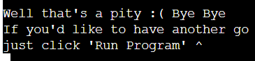

- **Data Structures**

  - The main data structure used in this application is room_list. This is a list of dictionaries, each dict representing a room in the dungeon. Each dict in the list has a different combination of keys and values depending on the 'room'. The player starts at room 0, index 0 in list, and this is updated to as player progresses through the dungeon. Every function uses the data stored in this list. Prints statements are retrieved, monster presence and instances are created using this data, next available room(s) displayed to the user, etc. 

  - Two classes are also used in this application, one for Player, and one Monster. Player is initialised at the very start as the 'player' variable and is used in ever function except for 'start'. The Monster class is initialised in the run_battle function and an instance created using the values in room_list as well as the monster_presence value.

### Features Left to Implement

- One user stated they would like more classes and a larger dungeon. This could be implemented by adding extra 'rooms' with their associated data to the rooms list. Player classes could be done similarly, when creating a character extra choices could be offered to player and data could be stored in another list for example.

- I had intended originally to have the monsters, and their attributes, be randomly generated but in the end decided to just create instances based on the room. I could implement this in future by giving the function an assortment of monster class and hp/attack values to use, which would be stored in another data structure.

- I had also intended to include a visual element to the application. I considered adding style to the terminal and page background themselves and also adding ascii art to the 'dungeon'. My mentor advised as this is a python project I should focus mainly on getting the actual logic functioning as intended and so the style was left on the long finger and ultimately discarded. This is something I would like to implement in future however as I feel it would only add to the application.

- The application does not function on mobile. This is due to the 'enquiries' module. The lack of arrow keys makes navigation impossible. I brought this matter up with my mentor and was once again told that the actual logic was the most important aspect of this project but I should look into it. I then appealed for assistance in Slack and when I received no replies I contacted student tutoring services. It was recommended by them that I enquiry to student care about the assessment criterion of this project. I did this, and was told that it was not necessary, per the assessment criteria, for this application to be responsive on mobile devices at the pass level. This was my interpretation as well, so I made the choice to continue using the enquiries module as I felt it added functionality to the application that I wanted. If I were to add mobile functionality in the future I feel this would be very straightforward. I would either use inputs in conjunction with validation instead of the 'menu' or I would research and hopefully find a module with similar functionality as enquiries but responsive on mobile.

## Testing
The application has been consistently tested throughout its development by both myself and others. The gender and age of testers varied, with age ranging from 20s to 60s and testers having a diverse range of computer knowledge, and each tester found the application intuitive and easy to use.

As mentioned, this site is not functional to its intended degree on mobile. All users who helped test this application were made aware of this and tested it on desktop/laptop devices and found it to be working correctly.
 
Several bugs were found in development but all were corrected to the best of my knowledge at the submission of this project. 

This project had one major direction change made at the behest of my mentor, which caused a larger rewriting of all major functions. This was difficult but improved the code by an appreciable margin and I feel it imporoved my knowledge and coding ability.

All code was passed throught the PEP8 linter and confirmed OK. 

### Validator Testing

No errors returned from PEP8 linter - http://pep8online.com/

### Unfixed Bugs

- As mentioned above, the application does not function on mobile, however this was a design choice I made based on my own interpretation of assessment criteria, as well as input from my mentor and student care. I am including this here as it is something I can see myself changing in the future, just for the sake of perfectionism, but I am happy with the application as it stands.

## Deployment

- The site was deployed to Heroku. The steps to deploy are as follows:
  - Create a heroku account
  - Select create new app on heroku dashboard, and fill out necessary requirements (name, etc.).
  - Once app is created, navigate to 'settings'. Set your config vars if relevant, for this project a key of PORT and value of 8000 were used. Add relevant buildpacks, for this project these were Python and Node.js. 
  - Next navigate to 'deploy'. For this project the deployment method chosen was Github. The relevant github account and repository must be connected and then either manual or automatic deployment chosen.
  - Once the app is succesfully built it will then be deployed and be 'live'

The live link can be found here - https://adventure-time-rpg.herokuapp.com/

## Credits

Credit to Code Institute for mock terminal.

I am hugely grateful to the Code Institute tutors, especially Jo, Kevin, and Ed for their patient help with this project. Without them it would not have gone nearly so smoothly, especially when a large rewrite was required.

Minor inspiration was taken from https://thecodingpie.com/post/make-your-own-text-based-adventure-game-in-python3.

My mentor was very helpful and his knowledge and experience is highly appreciated. His recommendation halfway through this project to rewrite most of the functions was daunting but ultimately improved the project and I believe (or at least hope) improved my abilities as a coder also.

